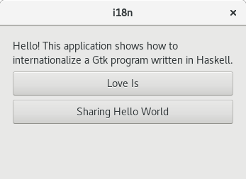
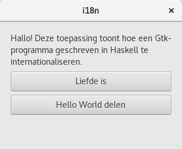

# Internationalization (i18n) and localization (i10n)

When internationalizing your application, strings sourced from two different
places need to be distinguished, because they need different approaches:

1. Translating strings from glade ui files, which only requires setting up your
glade file correctly and needs no modifications to your Haskell code. 
2. Translating strings coded in your application itself. This depends on a
Haskell implementation of or wrappers around GNU gettext. This should be 
approached similarly as normal i18n of Haskell programs, as discussed for 
example [here](https://wiki.haskell.org/Internationalization_of_Haskell_programs_using_gettext).

The text below deals with situation 1.

## Translating glade files

The important steps here are:

1. Defining a `domain` attribute for the `interface` tag in each glade file
2. Marking the translatable strings with a `translatable` attribute
3. Extracting the strings and compiling the translations with `xgettext` / 
   `msgfmt`
4. Copying the mo files to `/usr/share/locale/<language_code>/LC_MESSAGES/` 
   with the domain set in step 1 as the file name.

As you can see, it is not necessary in any step to write Haskell code when
translating glade files.

Below follows an example of an English application internationalized to Dutch.

### Base program without i18n

In the src folder you can find a basic program that shows a window with a label
and two buttons. All text should be in English. After doing 
`stack build`, you can run it with `stack exec i18n`. You should see:



All interface elements and their texts are actually defined in 
`ui/i18n.ui`. These get loaded by the `loadWindow` function in 
`Main.hs`.

### 1. Defining a domain attribute

First the domain for the application must be specified. The domain is the name 
under which your program will look for translations. For example, if you run an
application with domain "com.example.i18n" in a French session, translation will
be sought by default in `/usr/share/locale/fr/LC_MESSAGES/com.example.i18.mo`.

The domain is specified by adding the xml attribute `domain=""` to the toplevel
`interface` xml tag in the glade file: `<interface domain="com.example.i18n">`

### 2. Marking the translatable strings

If you use the Glade designer this is often already done automatically,
but if you write your xml yourself this is important.

The trick is that text that must be translated must be marked with the 
`translatable` attribute. Look in the `i18n.ui` file for details, but
here is an example. The following xml snippet defines the label containing the
main message:

```xml
<object class="GtkLabel">
  <property name="visible">True</property>
  <property name="can_focus">False</property>
  <property name="label" translatable="yes">
     Hello! This application shows how 
     to internationalize a Gtk program written in Haskell.
  </property>
  <property name="wrap">True</property>
  <property name="max_width_chars">40</property>
</object>
```

### 3. Extracting strings and compiling them

There is now still no way to translate the strings. For that we must extract
them. We can do this with multiple tools, but one reliable way is with xgettext.
From the project directory run the following command:

`gettext -L Glade -o po/i18n.pot ui/i18n.ui`

Per language you want to translate to, copy the pot file to a po file with
the language code as its name. For details on using the po format, see for
example [gnu's guide](https://www.gnu.org/server/standards/translations/po-how-to.html).
An example Dutch translation has been provided as `nl.po`.

Compile your po file into a mo file using msgfmt: `msgfmt po/nl.po -o po/nl.mo`

### 4. Copying the translations

Almost done! To finish, we must place each translation in its corresponding
language's LC_MESSAGES directory. Remember that the filename must match the 
domain set in the glade file. So for the Dutch example that is:

`sudo cp po/nl.mo /usr/share/locale/nl/LC_MESSAGES/com.example.i18n.mo`

Running `LANG=nl_NL.UTF-8 stack exec i18n` should now look like this:



Adding more languages is done by copying the i18n.pot to <language_code>.po, 
translating the strings in there, compiling it with msgfmt, and copying the file
to its corresponding LC_MESSAGES directory.

Of course, normally you wouldn't manually copy the translations. Instead, you
would package your program and let the package manager / installer do that for 
you. Alternatively, it is possible to programmatically set a different directory
for your application to look for translations in with [bindTextDomain](http://hackage.haskell.org/package/hgettext-0.1.31.0/docs/Text-I18N-GetText.html).
